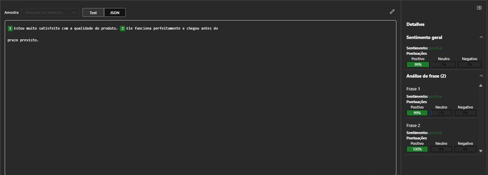
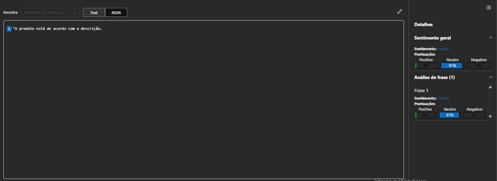
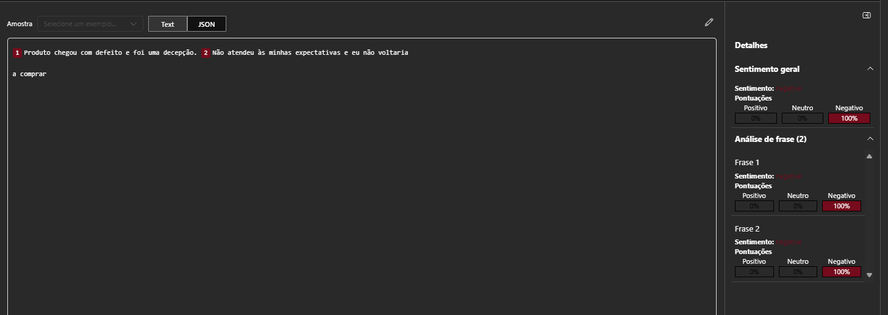

# Análise de Sentimento com Azure AI Foundry

## O que é Análise de Sentimento?

A **análise de sentimento** é uma técnica de **Processamento de Linguagem Natural (PLN)** utilizada para identificar e classificar as emoções expressas em um texto. Ela pode ser aplicada para entender melhor o tom de opiniões, comentários, avaliações ou qualquer tipo de feedback, classificando-o em três categorias principais: **positivo**, **negativo** ou **neutro**.

Essa técnica é extremamente útil em diversas áreas, como **atendimento ao cliente**, **marketing**, **análise de opiniões em redes sociais** e até **desenvolvimento de produtos**. Com a análise de sentimentos, é possível obter insights valiosos sobre a percepção de consumidores e usuários.

## Exemplos de Texto

Neste projeto, utilizei o **Azure AI Foundry** para classificar o sentimento de algumas sentenças, com diferentes tipos de feedback.

### Texto Positivo
- *"Estou muito satisfeito com a qualidade do produto. Ele funciona perfeitamente e chegou antes do prazo previsto."*

### Texto Neutro
- *"O produto está de acordo com a descrição."*

### Texto Negativo
- *"Produto chegou com defeito e foi uma decepção. Não atendeu às minhas expectativas e eu não voltaria a comprar."*

## Imagens dos Resultados

Aqui estão as imagens que mostram os resultados da análise de sentimento para cada um dos textos fornecidos:

### Resultado do Texto Positivo

### Resultado do Texto Neutro

### Resultado do Texto Negativo

## Conclusão

A análise de sentimentos com a **Azure AI Foundry** se mostrou uma ferramenta eficaz para identificar e classificar emoções em textos. Ao aplicar essa técnica, é possível ter uma visão mais clara do sentimento expresso em feedbacks e comentários. Isso facilita a compreensão de como os usuários percebem um produto, serviço ou experiência, permitindo ajustes mais assertivos na estratégia de atendimento ou desenvolvimento.

Com a integração dessa tecnologia, empresas podem otimizar seus processos, melhorando a comunicação com clientes e ajustando suas ofertas com base nas emoções identificadas nos feedbacks.
